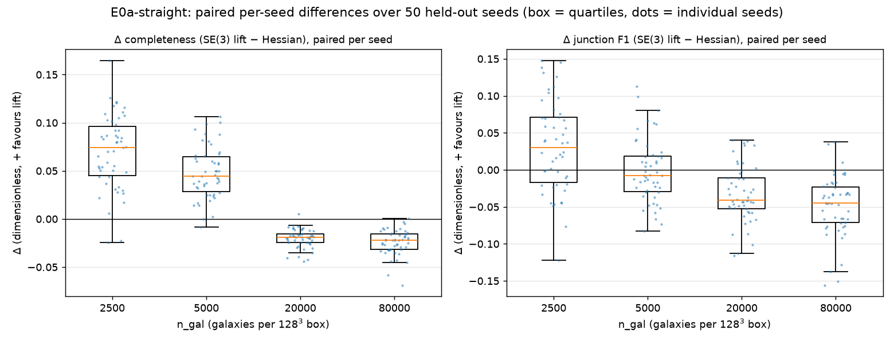
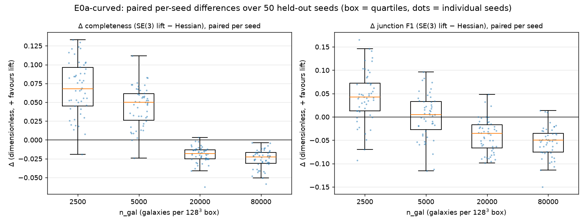

# E0a — orientation-lifted vs Hessian filament extraction (Voronoi toy, exact truth)

**Question (H1):** does lifting a galaxy density field to the position–orientation manifold R³×S² recover filament spines better than the quadratic (Hessian) orientation response, at identical post-processing and matched skeleton length?

**Setup.** Voronoi filament model in a 128³ box (1 voxel = 1 h⁻¹Mpc at the nominal L=128 h⁻¹Mpc): filaments are Voronoi-cell edges (straight variant) or Bézier-bent edges (curved variant, sag ≈ 15% of length); galaxies = arclength-uniform points with transverse Gaussian scatter σ=0.8 vox + 15% node clumps + 25% uniform background; field = CIC deposit → log(1+δ) → Gaussian smooth σ=1. Exact truth: the generating curves and vertices.

**Protocol.** Each method gets 3 candidate configs; the best on calibration seed 1 (mean C+P+jF1 over sampling levels) is frozen, then evaluated on held-out seeds. Both methods share hysteresis thresholding, matched-length skeletonization (mask volume bisection, tube area 9 vox²), speckle pruning ≥4 vox, and junction clustering.

## Metric definitions

- **Completeness (M1)** = fraction of truth-curve sample points within r₀=2 vox of the estimated skeleton.
- **Purity (M1)** = fraction of estimated skeleton voxels within r₀=2 vox of a truth curve.
- **Junction F1 (M2)** = harmonic mean of precision/recall of greedy one-to-one matching of estimated junction centroids to true Voronoi vertices within r₀=3 vox.
- **Δ(lift−hess) C** = per-seed paired completeness difference, mean over held-out seeds; (k/n seeds +) counts seeds where the lift wins.
- All numbers: mean ± sd over held-out eval seeds; matched skeleton length ⇒ completeness/purity trade on equal footing.

## Straight filaments

Chosen configs — lift: `{'sig_par': 6.0, 'sig_perp': 1.5, 'diff_iter': 0}`, hessian: `{'sigma': 1.5}`.

### Per-method summary

| n_gal | method | completeness mean ± sd | median (p10–p90) | purity | junction F1 |
|---|---|---|---|---|---|
| 2500 | se3_lift | 0.819 ± 0.047 | 0.813 (0.762–0.883) | 0.957 ± 0.011 | 0.568 ± 0.051 |
| 2500 | hessian | 0.749 ± 0.037 | 0.748 (0.704–0.793) | 0.975 ± 0.006 | 0.536 ± 0.060 |
| 5000 | se3_lift | 0.933 ± 0.022 | 0.936 (0.898–0.959) | 0.980 ± 0.007 | 0.610 ± 0.054 |
| 5000 | hessian | 0.886 ± 0.026 | 0.882 (0.849–0.922) | 0.991 ± 0.004 | 0.612 ± 0.053 |
| 20000 | se3_lift | 0.964 ± 0.013 | 0.966 (0.944–0.982) | 0.986 ± 0.006 | 0.619 ± 0.054 |
| 20000 | hessian | 0.984 ± 0.008 | 0.985 (0.974–0.993) | 0.997 ± 0.002 | 0.652 ± 0.049 |
| 80000 | se3_lift | 0.960 ± 0.016 | 0.962 (0.935–0.976) | 0.983 ± 0.006 | 0.608 ± 0.054 |
| 80000 | hessian | 0.984 ± 0.008 | 0.986 (0.976–0.992) | 0.998 ± 0.002 | 0.657 ± 0.054 |

### Paired differences (the H1 evidence)

| n_gal | n seeds | ΔC mean | ΔC median (p10–p90) | lift wins | Wilcoxon p (ΔC) | ΔjF1 mean | Wilcoxon p (ΔjF1) |
|---|---|---|---|---|---|---|---|
| 2500 | 50 | **+0.070** | +0.074 (+0.026–+0.116) | 48/50 | 5.9e-14 | +0.031 | 0.0015 |
| 5000 | 50 | **+0.048** | +0.044 (+0.016–+0.088) | 48/50 | 1.2e-14 | -0.002 | 0.5 |
| 20000 | 50 | **-0.020** | -0.019 (-0.032–-0.009) | 1/50 | 3.6e-15 | -0.033 | 1.3e-07 |
| 80000 | 50 | **-0.024** | -0.022 (-0.037–-0.010) | 1/50 | 3.6e-15 | -0.049 | 5e-11 |

## Curved filaments

Chosen configs — lift: `{'sig_par': 6.0, 'sig_perp': 1.5, 'diff_iter': 0}`, hessian: `{'sigma': 1.5}`.

### Per-method summary

| n_gal | method | completeness mean ± sd | median (p10–p90) | purity | junction F1 |
|---|---|---|---|---|---|
| 2500 | se3_lift | 0.816 ± 0.038 | 0.816 (0.771–0.863) | 0.951 ± 0.015 | 0.559 ± 0.053 |
| 2500 | hessian | 0.747 ± 0.033 | 0.747 (0.711–0.780) | 0.974 ± 0.007 | 0.515 ± 0.043 |
| 5000 | se3_lift | 0.931 ± 0.022 | 0.930 (0.906–0.960) | 0.974 ± 0.009 | 0.600 ± 0.056 |
| 5000 | hessian | 0.887 ± 0.025 | 0.883 (0.861–0.923) | 0.990 ± 0.004 | 0.599 ± 0.050 |
| 20000 | se3_lift | 0.965 ± 0.014 | 0.966 (0.949–0.983) | 0.983 ± 0.006 | 0.611 ± 0.050 |
| 20000 | hessian | 0.985 ± 0.007 | 0.985 (0.977–0.993) | 0.997 ± 0.002 | 0.652 ± 0.047 |
| 80000 | se3_lift | 0.959 ± 0.015 | 0.960 (0.942–0.975) | 0.980 ± 0.008 | 0.604 ± 0.055 |
| 80000 | hessian | 0.984 ± 0.008 | 0.985 (0.976–0.993) | 0.997 ± 0.002 | 0.658 ± 0.052 |

### Paired differences (the H1 evidence)

| n_gal | n seeds | ΔC mean | ΔC median (p10–p90) | lift wins | Wilcoxon p (ΔC) | ΔjF1 mean | Wilcoxon p (ΔjF1) |
|---|---|---|---|---|---|---|---|
| 2500 | 50 | **+0.069** | +0.068 (+0.020–+0.116) | 49/50 | 1.2e-14 | +0.044 | 7.7e-07 |
| 5000 | 50 | **+0.044** | +0.050 (+0.010–+0.073) | 48/50 | 1.6e-13 | +0.001 | 0.69 |
| 20000 | 50 | **-0.019** | -0.018 (-0.032–-0.009) | 1/50 | 8.9e-15 | -0.041 | 2.5e-10 |
| 80000 | 50 | **-0.025** | -0.023 (-0.042–-0.012) | 0/50 | 1.8e-15 | -0.054 | 3.4e-14 |

## Verdict on H1 (toy-level)

- **straight**: at the sparsest level (n_gal=2500) the lift wins completeness on 48/50 held-out seeds, mean Δ = +0.070 (Wilcoxon signed-rank p = 5.9e-14); at the densest level Δ = -0.024 (p = 3.6e-15).
- **curved**: at the sparsest level (n_gal=2500) the lift wins completeness on 49/50 held-out seeds, mean Δ = +0.069 (Wilcoxon signed-rank p = 1.2e-14); at the densest level Δ = -0.025 (p = 1.8e-15).

**Supported (partially):** the orientation lift consistently improves spine completeness in the sparse-sampling regime (the survey-realistic one), at a small purity cost and matched skeleton length; the Hessian baseline is marginally but significantly better when sampling is dense — a crossover, not a uniform win. At n=50 seeds the junction sub-claim resolves the same way: junction F1 significantly favours the lift at the sparsest level and the Hessian at dense levels (see the paired-difference tables). **Not supported:** the hypoelliptic-diffusion component — calibration rejected it (diff_iter=0 won) on BOTH straight and curved filaments, so all observed gains come from the elongated oriented filters alone.

## Open questions / next tests

1. **Why doesn't diffusion help?** Candidates: bend level too mild (sag 15%); diffusion parameters not co-calibrated with filter scales; matched-length extraction absorbing its benefit. Next: sweep bend_frac ∈ {0.15, 0.3, 0.5} × diffusion strength, and score curvature-binned completeness (does diffusion win specifically on high-curvature arcs?).
2. **Junctions:** node clumps make junctions easy for both methods. Re-run with node_frac=0 — the lift should shine when junctions are only implied by filament continuity.
3. **Gravity realism (E1):** port the benchmark to a Zel'dovich / N-body field where filaments are tidal-sheared, not tubular — the regime the physics prior (tidal-modulated coefficients, H2) targets.
4. **Tier B:** the current extraction skeletonises the ridgeness; true SR geodesic tracing on the lifted graph is not yet exercised and is where curvature penalties enter explicitly.
