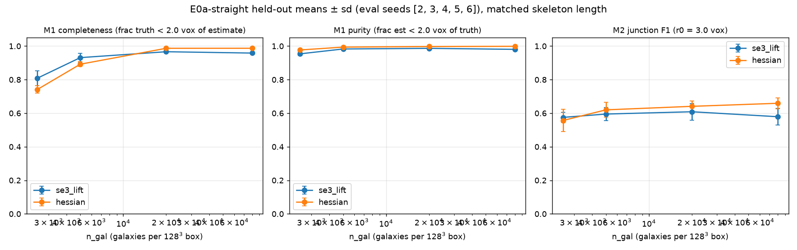
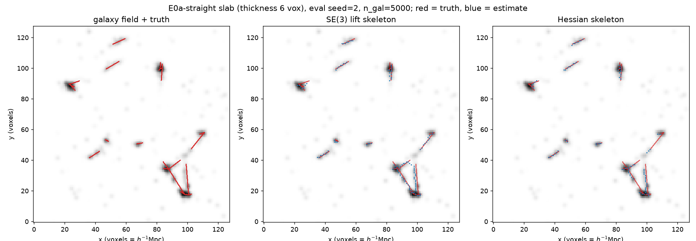
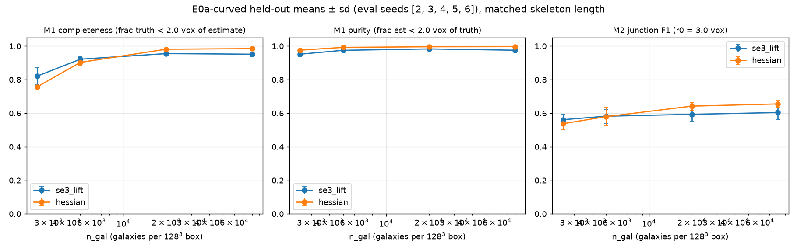
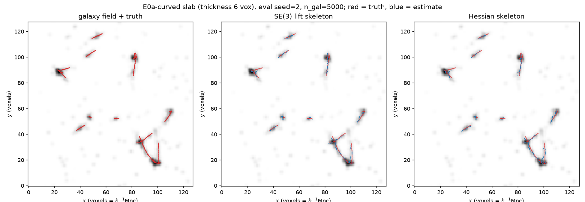

# E0a — orientation-lifted vs Hessian filament extraction (Voronoi toy, exact truth)

**Question (H1):** does lifting a galaxy density field to the position–orientation manifold R³×S² recover filament spines better than the quadratic (Hessian) orientation response, at identical post-processing and matched skeleton length?

**Setup.** Voronoi filament model in a 128³ box (1 voxel = 1 h⁻¹Mpc at the nominal L=128 h⁻¹Mpc): filaments are Voronoi-cell edges (straight variant) or Bézier-bent edges (curved variant, sag ≈ 15% of length); galaxies = arclength-uniform points with transverse Gaussian scatter σ=0.8 vox + 15% node clumps + 25% uniform background; field = CIC deposit → log(1+δ) → Gaussian smooth σ=1. Exact truth: the generating curves and vertices.

**Protocol.** Each method gets 3 candidate configs; the best on calibration seed 1 (mean C+P+jF1 over sampling levels) is frozen, then evaluated on held-out seeds. Both methods share hysteresis thresholding, matched-length skeletonization (mask volume bisection, tube area 9 vox²), speckle pruning ≥4 vox, and junction clustering.

## Metric definitions

- **Completeness (M1)** = fraction of truth-curve sample points within r₀=2 vox of the estimated skeleton.
- **Purity (M1)** = fraction of estimated skeleton voxels within r₀=2 vox of a truth curve.
- **Junction F1 (M2)** = harmonic mean of precision/recall of greedy one-to-one matching of estimated junction centroids to true Voronoi vertices within r₀=3 vox.
- **Δ(lift−hess) C** = per-seed paired completeness difference, mean over held-out seeds; (k/n seeds +) counts seeds where the lift wins.
- All numbers: mean ± sd over held-out eval seeds; matched skeleton length ⇒ completeness/purity trade on equal footing.

## Straight filaments

Chosen configs — lift: `{'sig_par': 6.0, 'sig_perp': 1.5, 'diff_iter': 0}`, hessian: `{'sigma': 1.5}`.

| n_gal | method | completeness | purity | junction F1 | Δ(lift−hess) C |
|---|---|---|---|---|---|
| 2500 | se3_lift | 0.809 ± 0.045 | 0.954 ± 0.010 | 0.575 ± 0.030 | **+0.067** (5/5 seeds +) |
| 2500 | hessian | 0.741 ± 0.022 | 0.977 ± 0.005 | 0.557 ± 0.067 |  |
| 5000 | se3_lift | 0.931 ± 0.026 | 0.983 ± 0.006 | 0.595 ± 0.038 | **+0.039** (5/5 seeds +) |
| 5000 | hessian | 0.892 ± 0.014 | 0.994 ± 0.001 | 0.620 ± 0.045 |  |
| 20000 | se3_lift | 0.966 ± 0.008 | 0.987 ± 0.007 | 0.609 ± 0.049 | **-0.020** (0/5 seeds +) |
| 20000 | hessian | 0.987 ± 0.004 | 0.997 ± 0.002 | 0.641 ± 0.032 |  |
| 80000 | se3_lift | 0.958 ± 0.006 | 0.980 ± 0.007 | 0.579 ± 0.049 | **-0.029** (0/5 seeds +) |
| 80000 | hessian | 0.987 ± 0.004 | 0.999 ± 0.002 | 0.659 ± 0.033 |  |

## Curved filaments

Chosen configs — lift: `{'sig_par': 6.0, 'sig_perp': 1.5, 'diff_iter': 0}`, hessian: `{'sigma': 1.5}`.

| n_gal | method | completeness | purity | junction F1 | Δ(lift−hess) C |
|---|---|---|---|---|---|
| 2500 | se3_lift | 0.821 ± 0.051 | 0.952 ± 0.013 | 0.561 ± 0.034 | **+0.064** (5/5 seeds +) |
| 2500 | hessian | 0.757 ± 0.009 | 0.976 ± 0.007 | 0.538 ± 0.034 |  |
| 5000 | se3_lift | 0.922 ± 0.015 | 0.975 ± 0.008 | 0.582 ± 0.042 | **+0.019** (4/5 seeds +) |
| 5000 | hessian | 0.903 ± 0.017 | 0.992 ± 0.002 | 0.579 ± 0.055 |  |
| 20000 | se3_lift | 0.955 ± 0.007 | 0.983 ± 0.006 | 0.593 ± 0.041 | **-0.026** (0/5 seeds +) |
| 20000 | hessian | 0.981 ± 0.006 | 0.996 ± 0.002 | 0.642 ± 0.023 |  |
| 80000 | se3_lift | 0.952 ± 0.012 | 0.975 ± 0.011 | 0.604 ± 0.040 | **-0.033** (0/5 seeds +) |
| 80000 | hessian | 0.985 ± 0.005 | 0.997 ± 0.001 | 0.655 ± 0.020 |  |

## Verdict on H1 (toy-level)

- **straight**: at the sparsest level (n_gal=2500) the lift wins completeness on 5/5 held-out seeds, mean Δ = +0.067; at the densest level Δ = -0.029.
- **curved**: at the sparsest level (n_gal=2500) the lift wins completeness on 5/5 held-out seeds, mean Δ = +0.064; at the densest level Δ = -0.033.

**Supported (partially):** the orientation lift consistently improves spine completeness in the sparse-sampling regime (the survey-realistic one), at a small purity cost and matched skeleton length; the Hessian baseline is marginally better when sampling is dense. **Not supported:** (i) the junction sub-claim — M2 is statistically tied; (ii) the hypoelliptic-diffusion component — calibration rejected it (diff_iter=0 won) on BOTH straight and curved filaments, so all observed gains come from the elongated oriented filters alone.

## Open questions / next tests

1. **Why doesn't diffusion help?** Candidates: bend level too mild (sag 15%); diffusion parameters not co-calibrated with filter scales; matched-length extraction absorbing its benefit. Next: sweep bend_frac ∈ {0.15, 0.3, 0.5} × diffusion strength, and score curvature-binned completeness (does diffusion win specifically on high-curvature arcs?).
2. **Junctions:** node clumps make junctions easy for both methods. Re-run with node_frac=0 — the lift should shine when junctions are only implied by filament continuity.
3. **Gravity realism (E1):** port the benchmark to a Zel'dovich / N-body field where filaments are tidal-sheared, not tubular — the regime the physics prior (tidal-modulated coefficients, H2) targets.
4. **Tier B:** the current extraction skeletonises the ridgeness; true SR geodesic tracing on the lifted graph is not yet exercised and is where curvature penalties enter explicitly.
