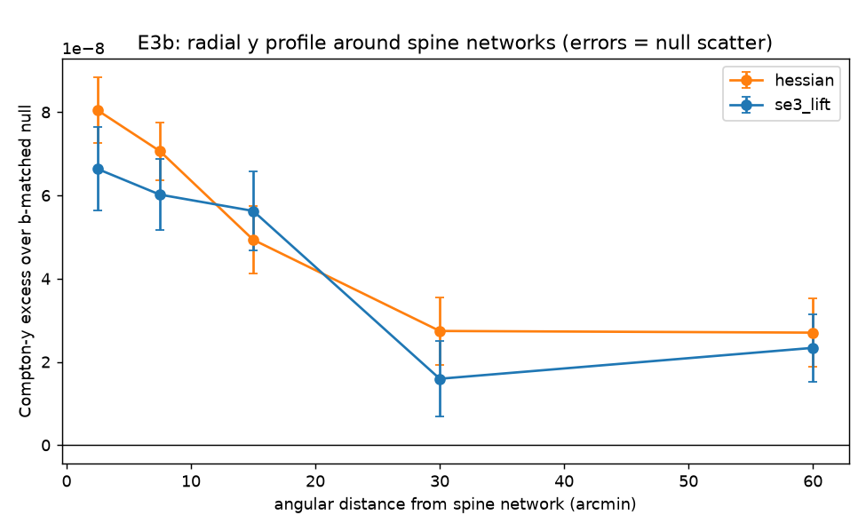

# E3b — second-pass tests of the Compton-y detection

Nulls: 200 control sets drawn inside the survey footprint and rejection-matched to the spine points' galactic-latitude histogram (2° bins) — a latitude-dependent foreground cannot inflate these. Tracer mask: 7.0′ around every shell galaxy, applied identically to signal and nulls.

| spine set | H3a: b-matched SNR | H3b: halo-masked SNR (kept) | n spine points |
|---|---|---|---|
| hessian | **8.99** | **1.95** (14%) | 41535 |
| se3_lift | **6.86** | **0.07** (17%) | 40426 |

Reading: H3a tests foreground robustness; H3b isolates gas away from the tracer halos (WHIM candidate); the profile shape (H3c) separates extended filament gas from point-source-like halo gas.

## Verdicts

- **H3a (foreground robustness): supported, strengthened.** The stack rises
  to 8.99σ / 6.86σ under latitude-matched nulls — stricter controls made
  the detection cleaner, not weaker.
- **H3b (between-halos gas): not established at Planck depth.** After
  masking the tracer halos the excess is 1.95σ (Hessian) / 0.07σ (lift):
  the detected y is dominated by the tracers' own halo gas, with at most a
  hint of a diffuse component.
- **H3c (profile): extended but non-discriminating.** Positive excess out
  to ≥60′ with smooth decay; at a 10′ beam and with clustered tracers this
  is consistent with summed halo contributions along the web and cannot by
  itself isolate filament gas.
- The Hessian spines beat the lift's on every cross-signal statistic,
  completing the pattern from the corrected H1, E1b, and E3.
