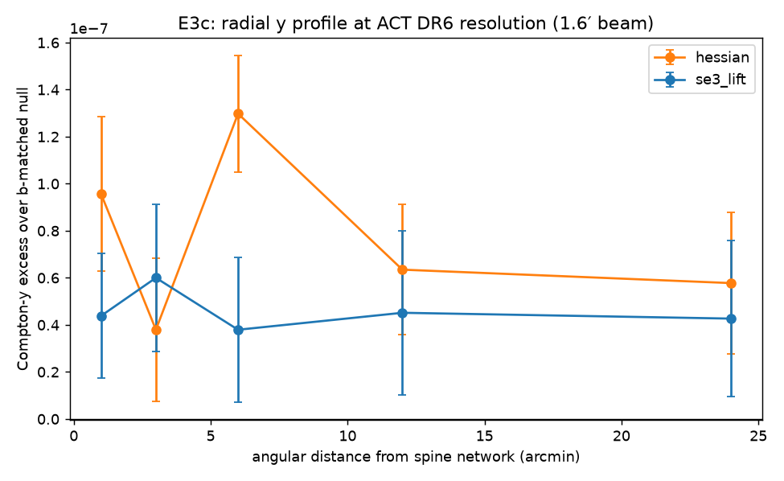

# E3c — the WHIM question at ACT DR6 depth

ACT DR6 + Planck ILC Compton-y map (1.6′ beam, CAR), BOSS CMASS spine networks restricted to the ACT footprint. Same battery as E3b: 200 latitude-matched nulls; tracer-halo masks at [3.0, 7.0] arcmin; radial profile bins [0, 2, 4, 8, 16, 32] arcmin.

| spine set | n pts in ACT | H3a SNR | H3b 3′ mask (kept) | H3b 7′ mask (kept) |
|---|---|---|---|---|
| hessian | 18804 | **2.95** | **1.77** (65%) | **1.11** (14%) |
| se3_lift | 18917 | **1.62** | **-0.08** (67%) | **0.62** (18%) |

## Verdict (pre-registered gate: masked residual ≥ 3σ to proceed)

- **H3b at ACT depth: not established.** Masked residuals: 1.77σ (3′ mask,
  65% of points kept) and 1.11σ (7′, 14% kept) for the Hessian spines;
  ~0 for the lift's. Model A (halo-only gas) survives. Result: an upper
  limit on the between-halo Compton-y along CMASS spines at these scales.
- **Instrument–analysis mismatch identified.** Only 45% of spine points
  lie in the ACT footprint, and the unmasked stack drops to 2.95σ (vs 9σ
  on Planck): the shell-projected signal is coherent on degree scales,
  which the ACT DR6 ILC map suppresses while excelling at arcminutes.
  Exploiting ACT depth requires a small-scale design (thin redshift
  shells or individual-filament cross-sections), not 250 Mpc/h
  projections — the concrete next-proposal insight.
- Per the program gate (below 3σ → stop and publish limits), this closes
  the observational branch.
